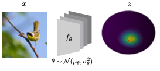

# Bayesian Metric Learning with Laplace Approximation

:computer: Official implementation for "Bayesian Metric Learning for Uncertainty Quantifiation in Image Retrieval" by Frederik Warburg*, Marco Miani*, Silas Brack and Søren Hauberg.

:fire: **tl;dr:** We use the Laplace Approximation for the Contrastive Loss to optimize a latent space with Metric Learning.

<p align="center">
  
</p>

:newspaper: **Abstract:** We propose the first Bayesian encoder for metric learning. Rather than relying on neural amortization as done in prior works, we learn a distribution over the network weights with the Laplace Approximation. We actualize this by first proving that the contrastive loss is a valid log-posterior. We then propose three methods that ensure a positive definite Hessian. Lastly, we present a novel decomposition of the Generalized Gauss-Newton approximation. Empirically, we show that our Laplacian Metric Learner (LAM) estimates well-calibrated uncertainties, reliably detects out-of- distribution examples, and yields state-of-the-art predictive performance.


## Getting Started

```
git clone https://github.com/FrederikWarburg/bayesian-metric-learning;
cd bayesian-metric-learning;
git clone https://github.com/IlMioFrizzantinoAmabile/stochman;
cd stochman;
python setup.py develop;
cd ../src;
```

Your file structure should look like:

```
bayesian-metric-learning
├── configs             # config files, organised by experiments
├── img                 # figures
├── scripts             # scripts for running code
├── src                 # source code
│   ├── datasets        # Code for data
│   ├── evaluate        # Code for evaluation
│   ├── lightning       # pytorch lightning models (+ baseliens)
|   ├── losses          # specialize loss functions
|   ├── miners          # miners
|   ├── models          # network architectures
│   └── utils           # helpers
├── requirements.txt    # file containing python packages that are required to run code
└── stochman
```

## Train your LAM

```
cd src;
CUDA_VISIBLE_DEVICES=0 python run.py --config ../configs/fashionmnist/laplace_online_arccos_fix.yaml;
```

or a baseline model (e.g. the deterministic model)

```
cd src;
CUDA_VISIBLE_DEVICES=0 python run.py --config ../configs/fashionmnist/deterministic.yaml;
```

Remember to change the data_dir in the .yaml config file.

## Citation

If you find this code useful, please consider citing us:

```bibtex
@article{Warburg2023LAM,
  title={Bayesian Metric Learning for Uncertainty Quantification in Image Retrieval},
  author={Frederik Warburg and Marco Miani and Silas Brack and Søren Hauberg},
  journal={CoRR},
  year={2023}
}
```

```bibtex
@article{LAE2022,
  title={Laplacian Autoencoders for Learning Stochastic Representations},
  author={Marco Miani and Frederik Warburg and Pablo Moreno-Muñoz and Nicki Skafte Detlefsen and Søren Hauberg},
  journal=Neurips,
  year={2022}
}
```


```bibtex
@article{software:stochman,
  title={StochMan},
  author={Nicki S. Detlefsen and Alison Pouplin and Cilie W. Feldager and Cong Geng and Dimitris Kalatzis and Helene Hauschultz and Miguel González Duque and Frederik Warburg and Marco Miani and Søren Hauberg},
  journal={GitHub. Note: https://github.com/MachineLearningLifeScience/stochman/},
  year={2021}
}
```